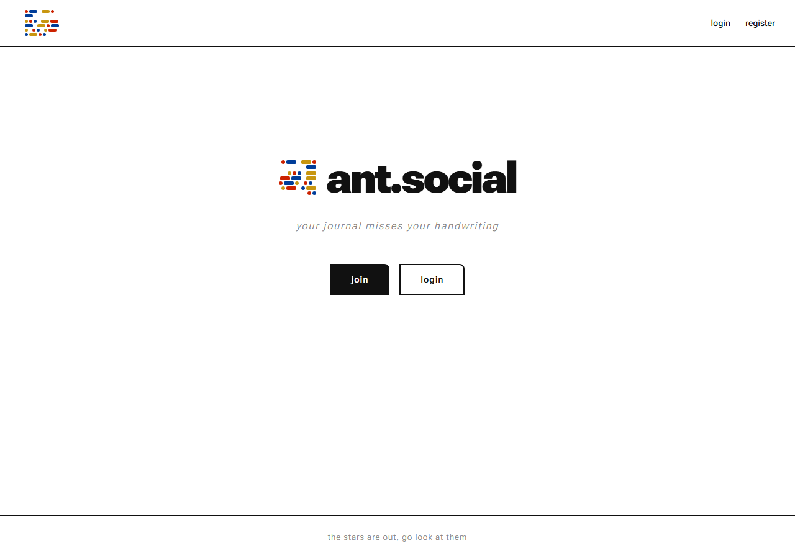
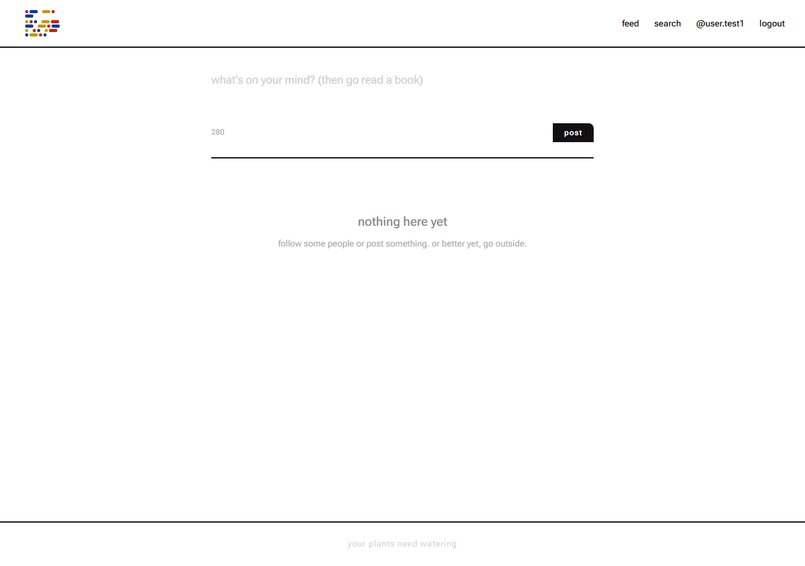
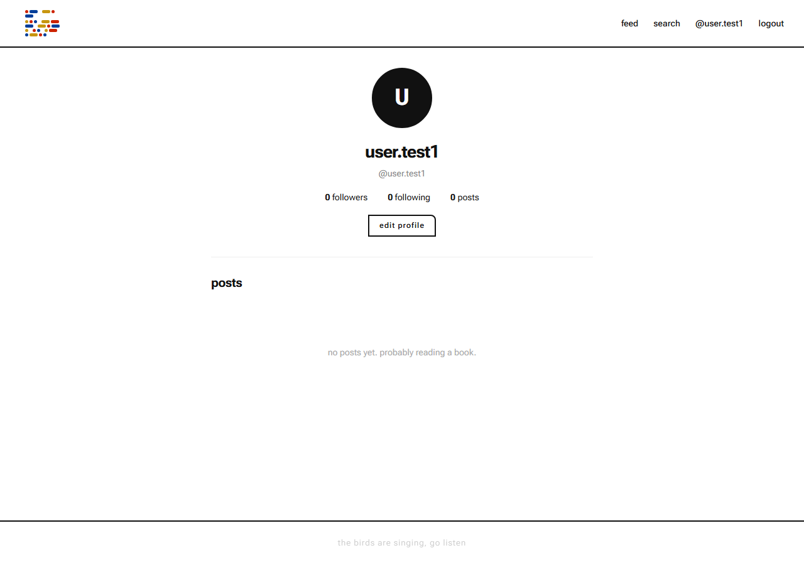
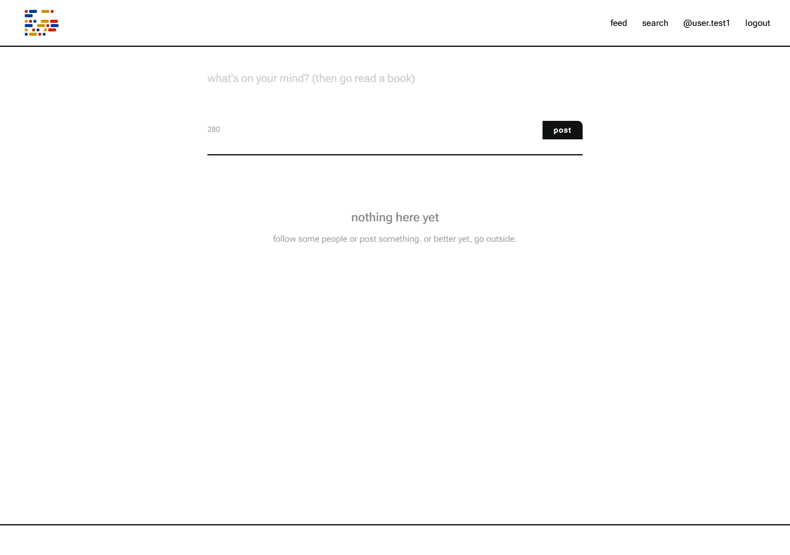
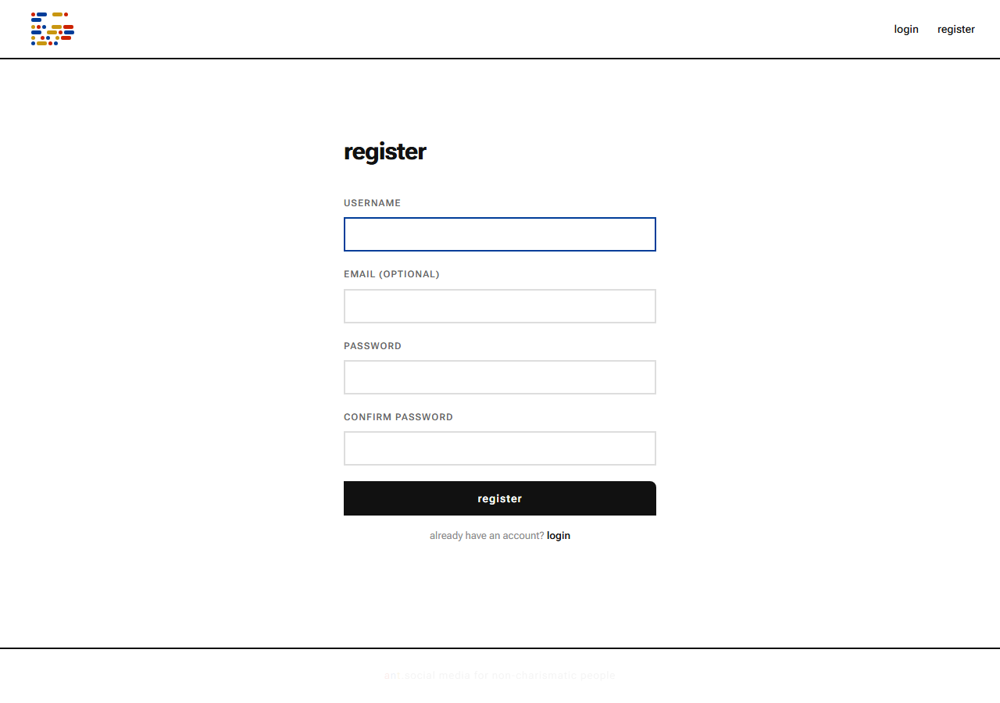
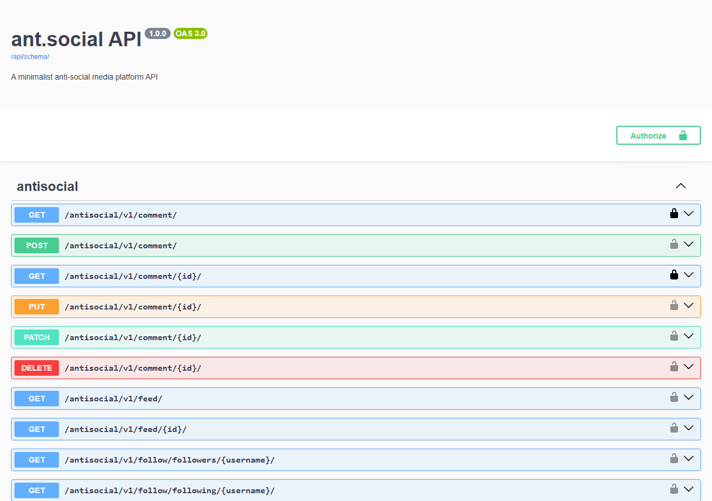

<p align="center">
  
</p>

<h1 align="center">ant.social</h1>
<p align="center"><em>go read a book.</em></p>

<p align="center">
  <a href="https://ant-social.onrender.com"><strong>🌐 Live Demo</strong></a> &nbsp;·&nbsp;
  <a href="https://ant-social.onrender.com/api/docs/"><strong>📖 API Docs (Swagger)</strong></a> &nbsp;·&nbsp;
  <a href="https://ant-social.onrender.com/api/redoc/"><strong>📄 Redoc</strong></a>
</p>

<p align="center">
  <a href="https://python.org"></a>
  <a href="https://djangoproject.com"></a>
  <a href="https://www.django-rest-framework.org"></a>
  <a href="https://django-rest-framework-simplejwt.readthedocs.io"></a>
  
  <a href="https://github.com/viniciussilva2504/social_media_API/actions/workflows/ci.yml"></a>
  <a href="LICENSE"></a>
</p>

---

**ant.social** is a full-stack social media platform built with Python, Django and Django REST Framework. It ships a complete web UI (Django templates) alongside a production-ready REST API — both living in the same codebase, deployed to Render with a free PostgreSQL database.

The visual identity is intentionally minimal and typographic, Bauhaus-inspired: primary colours (red, blue, yellow), Roboto Flex, and a morse-code logo spelling out `ant.social`.

---

## Screenshots

<p align="center">
  
  <br/><sub>Home — morse-code logo, rotating tagline, join/login CTAs</sub>
</p>

<p align="center">
  
  <br/><sub>Feed — 280-char compose box, personalized timeline with cached responses</sub>
</p>

<p align="center">
  
  <br/><sub>Profile — avatar, bio, followers/following stats, post history</sub>
</p>

<p align="center">
  
  <br/><sub>Post detail — inline comments, like toggle, edit/delete (owner only)</sub>
</p>

<p align="center">
  
  <br/><sub>Register — account creation with validation and throttling (5 req/min)</sub>
</p>

<p align="center">
  
  <br/><sub>Swagger UI — OpenAPI 3 schema with full interactive docs at <code>/api/docs/</code></sub>
</p>

---

## Why this project matters

| Dimension | What it demonstrates |
|---|---|
| **Backend ownership** | Auth, permissions, social graph, file uploads — all from scratch |
| **Full-stack delivery** | Web UI + REST API in a single Django codebase |
| **Engineering maturity** | CI pipeline, request tracing, versioned cache, rate limiting |
| **Frontend-ready** | OpenAPI 3 schema, Swagger/Redoc, CORS configured |
| **Production ops** | Docker, Gunicorn, WhiteNoise, Render deploy with free PostgreSQL |

---

## Core features

**Authentication**
- Session auth (web UI) + DRF Token auth + JWT (access & refresh via simplejwt)
- Auth throttling: `5/min` register · `10/min` login · `120/min` authenticated requests

**Profiles & social graph**
- Display name, bio, profile picture (extension + MIME type + file size validation)
- Follow / unfollow with followers and following lists

**Content**
- Posts up to 280 characters with optional image upload
- Soft delete — posts are marked inactive, never dropped from the database
- Likes (toggle) and threaded comments (full CRUD)

**Feed**
- Personalized feed: followed users + own posts, ordered chronologically
- Response-level cache with per-user versioned keys
- Event-driven cache invalidation on post, like, comment and follow events

**Observability & Moderation**
- Healthcheck at `/health/`
- `X-Request-ID` tracing: accepted from client, auto-generated if absent, echoed in response headers and logs
- Google Perspective API hook for content moderation (optional)

---

## Web UI pages

| Page | Description |
|---|---|
| `/` | Home — morse-code logo, rotating tagline, join/login |
| `/feed/` | Post feed with compose box, inline like/comment |
| `/post/<id>/` | Post detail, comment thread, edit/delete (owner only) |
| `/profile/<username>/` | Profile picture, bio, follower stats, post list |
| `/edit-profile/` | Update display name, bio, profile picture |
| `/followers/` · `/following/` | Social connections list |
| `/search/` | Search users by username |
| `/login/` · `/register/` | Authentication forms |

---

## Architecture

```
┌────────────────────────────────────────────────────────────┐
│                    Browser / API Client                    │
└───────────────────────────┬────────────────────────────────┘
                            │  HTTP
                            ▼
┌────────────────────────────────────────────────────────────┐
│               Django URL Router  (/antisocial/v1/)         │
│  ┌─────────────┐  ┌─────────────┐  ┌────────────────────┐ │
│  │  accounts/  │  │   posts/    │  │      books/        │ │
│  │  auth       │  │  post       │  │  book catalog      │ │
│  │  profile    │  │  feed       │  │  trade requests    │ │
│  │  follow     │  │  like       │  └────────────────────┘ │
│  └─────────────┘  │  comment    │                         │
│                   └─────────────┘                         │
└───────────────────────────┬────────────────────────────────┘
                            │
                            ▼
┌────────────────────────────────────────────────────────────┐
│           DRF ViewSets → Serializers → Services            │
│                                                            │
│   Middleware: X-Request-ID tracing · Content moderation    │
│   Permissions: IsAuthenticated · IsOwnerOrReadOnly         │
│   Throttling: ScopedRateThrottle per endpoint              │
└────────────┬───────────────────────────┬───────────────────┘
             │                           │
             ▼                           ▼
┌─────────────────────┐    ┌─────────────────────────────────┐
│   PostgreSQL (prod) │    │     Cache Layer (per-user)      │
│   SQLite    (dev)   │    │  Versioned feed keys            │
│                     │    │  Event-driven invalidation      │
└─────────────────────┘    └─────────────────────────────────┘
             │
             ▼
┌────────────────────────────────────────────────────────────┐
│   File Storage: local dev · Cloudinary (prod, optional)    │
└────────────────────────────────────────────────────────────┘
```

---

## Tech stack

| Layer | Technology |
|---|---|
| Language | Python 3.12+ |
| Framework | Django 5.x + Django REST Framework 3.14+ |
| Auth | Session · DRF Token · JWT (simplejwt) |
| API docs | drf-spectacular (OpenAPI 3, Swagger UI, Redoc) |
| Database | SQLite (dev) · PostgreSQL (prod) |
| Storage | Local filesystem · Cloudinary (optional) |
| Moderation | Google Perspective API (optional) |
| Deploy | Render · Docker Compose · Gunicorn · WhiteNoise |
| CI | GitHub Actions |

---

## Quick start (local)

```bash
git clone https://github.com/viniciussilva2504/social_media_API.git
cd social_media_API

# pip + venv
python -m venv .venv
.venv\Scripts\activate          # Windows
# source .venv/bin/activate     # macOS / Linux

pip install -r requirements.txt

set DEBUG=1
set SECRET_KEY=any-local-dev-key
set DJANGO_ALLOWED_HOSTS=localhost 127.0.0.1

python manage.py migrate
python manage.py runserver
```

Open → http://127.0.0.1:8000/

```bash
# Poetry
poetry install
poetry run python manage.py migrate
poetry run python manage.py runserver
```

---

## Docker (local with PostgreSQL)

```bash
docker compose build
docker compose up -d
docker compose exec web python manage.py migrate
```

Open → http://127.0.0.1:8000/

---

## Deploy to Render (free tier)

The project ships a ready-to-use [`render.yaml`](render.yaml) that provisions both the web service and a PostgreSQL database automatically.

1. Push this repo to GitHub
2. On [render.com](https://render.com) → **New** → **Blueprint**
3. Connect the repository
4. **Blueprint Path:** `render.yaml`
5. Click **Apply** — Render builds, migrates, and deploys in ~3 min

Optional env vars to add in the dashboard:

| Variable | Purpose |
|---|---|
| `CLOUDINARY_URL` | Cloud image storage |
| `PERSPECTIVE_API_KEY` | Content moderation |

---

## API endpoints

Base URL: `https://ant-social.onrender.com/antisocial/v1/`  
Interactive docs: [`/api/docs/`](https://ant-social.onrender.com/api/docs/)

### Auth
| Method | Endpoint | Description |
|---|---|---|
| `POST` | `/register/` | Create account |
| `POST` | `/login/` | Session login |
| `POST` | `/auth/jwt/token/` | Get JWT access + refresh |
| `POST` | `/auth/jwt/refresh/` | Refresh JWT access token |
| `POST` | `/api-token-auth/` | Get DRF token |

### Profile & Users
| Method | Endpoint | Description |
|---|---|---|
| `GET` | `/profile/` | List profiles |
| `GET` | `/profile/{username}/` | Get profile |
| `PATCH` | `/profile/me/` | Update own profile |
| `GET` | `/users/?q=search` | Search users |

### Follow
| Method | Endpoint | Description |
|---|---|---|
| `POST` | `/follow/toggle/{username}/` | Follow / unfollow |
| `GET` | `/follow/followers/{username}/` | Followers list |
| `GET` | `/follow/following/{username}/` | Following list |

### Posts & Feed
| Method | Endpoint | Description |
|---|---|---|
| `GET/POST` | `/post/` | List / create posts |
| `GET/PATCH/DELETE` | `/post/{id}/` | Retrieve / edit / delete |
| `GET` | `/feed/` | Personalized feed |

### Social interactions
| Method | Endpoint | Description |
|---|---|---|
| `POST` | `/like/toggle/{post_id}/` | Like / unlike |
| `GET` | `/comment/?post_id={id}` | List comments |
| `POST` | `/comment/` | Add comment |
| `DELETE` | `/comment/{id}/` | Delete comment |

### Docs & Health
| Endpoint | Description |
|---|---|
| `/api/schema/` | OpenAPI 3 schema (YAML) |
| `/api/docs/` | Swagger UI |
| `/api/redoc/` | Redoc |
| `/health/` | Healthcheck |

---

## Security highlights

- Django password validators (length, common password, similarity)
- Profile picture hardening: extension + file size (model) · MIME + image decoding (serializer)
- Auth throttling: `5/min` register · `10/min` login · `120/min` authenticated
- `X-Request-ID` tracing: accepted or auto-generated, echoed in response headers and logs
- `SECURE_CONTENT_TYPE_NOSNIFF`, `X-Frame-Options`, CORS explicitly configured

---

## Performance

- `select_related` / `prefetch_related` on feed and post queries
- Annotation-based like/comment counts (no N+1)
- Feed response cache with per-user versioned keys
- Cache invalidation triggered on: post create/delete · comment create/delete · like toggle · follow/unfollow

---

## Testing

```bash
pytest
```

Coverage includes auth, feed, posts, comments, likes, follows, permissions, healthcheck and request ID propagation.

---

## CI

GitHub Actions (`.github/workflows/ci.yml`) runs on every push and PR:
1. Install dependencies
2. Run migrations
3. Run full test suite

---

## License

MIT
